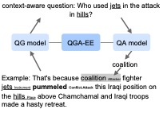

# Event-Extraction-as-Question-Generation-and-Answering

This repository contains the code for our ACL 2023
paper [Event Extraction as Question Generation and Answering]
(https://aclanthology.org/2023.acl-short.143/).

  

