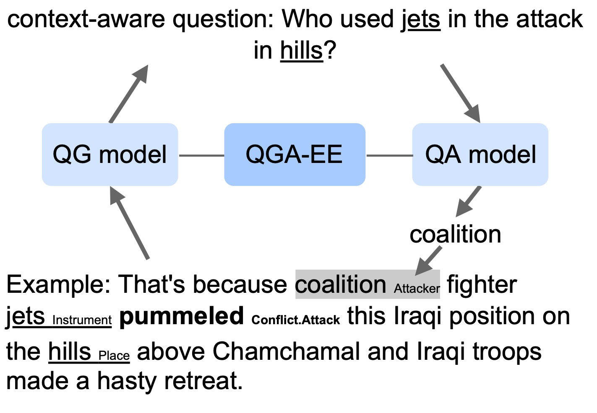

# Event-Extraction-as-Question-Generation-and-Answering

This repository contains the code for our ACL 2023
paper [Event Extraction as Question Generation and Answering](https://aclanthology.org/2023.acl-short.143/)
.


<p align='center'>
  
</p>

## ACE data preprocessing

Please refer to ```./data_process/README.md``` for details.

## Requirement

The code is based on Python 3.8+, and the scores reported are based on
experiments on a single AWS p3.2xlarge instance.

To install the required dependencies:

`pip install -r requirements.txt`

## Code

### Train and eval models

#### Train the Trigger Detection Model.

`bash ./train_event_trigger_model.sh`

The trained model will be saved in `./model_checkpoint/trigger_model` by
default.

#### Train the Question Generation Models.

`bash ./train_qg_bart.sh` for the BART backbone.

`bash ./train_qg_t5.sh` for the T5 backbone.

The trained model will be saved in `./model_checkpoint/qg_model_bart`
or `./model_checkpoint/qg_model_t5` for BART and T5 backbone respectively by
default.

#### Train Argument Extraction Models and Evaluate with Gold Event Triggers

`bash ./train_argument_extraction_bart.sh` for the BART backbone.

`bash ./train_argument_extraction_t5.sh` for the T5 backbone.

The trained model will be saved in `./model_checkpoint/eae_model_bart`
or `./model_checkpoint/eae_model_t5` for BART and T5 backbone respectively by
default.

#### Evaluate Argument Extraction models with System Predicted Event Triggers

`bash evaluate_e2e_predicted_triggers_bart.sh` for the BART backbone.

`bash evaluate_e2e_predicted_triggers_t5.sh` for the T5 backbone.

## Citation:

If you find the code in this repo helpful, please
cite [our paper](https://aclanthology.org/2023.acl-short.143/):

```bibtex
@inproceedings{lu-etal-2023-event,
    title = "Event Extraction as Question Generation and Answering",
    author = "Lu, Di  and
    Ran, Shihao  and
    Tetreault, Joel  and
    Jaimes, Alejandro",
    booktitle = "Proceedings of the 61st Annual Meeting of the Association for Computational Linguistics (Volume 2: Short Papers)",
    month = jul,
    year = "2023",
    address = "Toronto, Canada",
    publisher = "Association for Computational Linguistics",
    url = "https://aclanthology.org/2023.acl-short.143",
}
```
